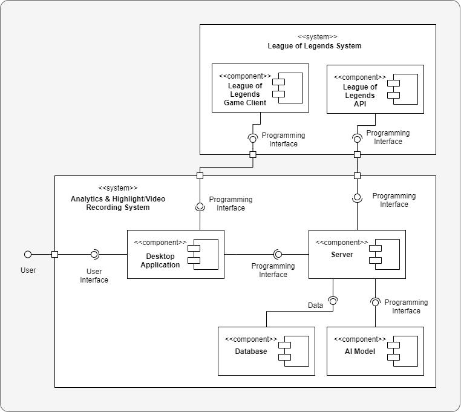

# Nexus - League of Legends Analytics/Recording Application (COMP3000)

## Introduction

League of Legends is a fast-paced online multiplayer game that requires strategy, teamwork and individual skill. Due to its competitive nature, players strive to improve and climb the ladder, however, the complexity and skill ceilling of the game makes it challening. Some players turn to software solutions for assistance, but few are effective. Nexus aims to provide a better solution which helps players learn and improve by providing the necessary tools to analyse, review and learn from their previous matches while automating as many of the processes and features of the application as possible to improve user experience.

## Objectives
### Primary Objectives

1. **Statistics and Analytics** – Provide the user with useful information about their matches and highlights through interactive charts and graphs.

2. **Automatic Recording** – A system which automatically records video and audio when a new match begins ensuring an effort-free and seamless capture of gameplay, which can be rewatched and analysed at a later time.

3. **Event Identification and Highlight Creation** – A feature powered by Artificial Intelligence which analyses the match’s data, identifies the most impactful events and compiles them into video clips reducing the need for players to manually analyse the gameplay of all of their matches.

4. **Recording and Highlight Management** – A user-friendly interface for managing the recorded content and highlights, enabling them to view, edit, and delete the video content.

5. **Manual Highlight Editing and Clipping** – Give users more control over their highlight reel by allowing users to manually capture highlights during the game via a shortcut as well as manually edit game recordings and create their highlights after the game.

### Stretch Objectives
To be implemented if there is additional time.

1. **Social Media Sharing** – Enable users to easily share their highlights on various social media platforms to increase community engagement and indirectly improve player performance.

2. **Cloud Storage** – Allow users to sync their recordings and highlights to the cloud to ensure their media is backed up and can be accessed via multiple devices.

## System Architecture
The system consists of six components which are required to achieve the functionality, some of which are external, such as the League of Legends API and game client, while others are internal.

## Tools & Technologies

These are some of the main tools and technologies that were used in this project.

* <kbd>React</kbd> was used to build the interactive interfaces with ease.
* <kbd>TypeScript</kbd> was the main programming language, used both on client-side and server-side.
* <kbd>Node.js</kbd> served as the backbone for both server-side operations and the desktop application.
* <kbd>Electron</kbd> served as a framework for building a desktop application using web technologies.
* <kbd>Turborepo</kbd> streamlined code reuse and type sharing across the stack.
* <kbd>MongoDB</kbd> was used to persist dynamic data.
* <kbd>Python</kbd> was used to create an unsupervised machine learning model for automatic highlight creation.

